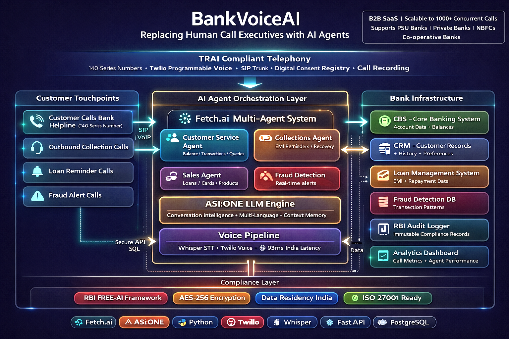

# BankVoiceAI — AI Call Executive Platform

**Replacing Human Call Executives with AI Agents**

[](https://fetch.ai)
[](https://asi1.ai)
[](https://python.org)
[](LICENSE)
[]()

> **An intelligent AI agent platform that handles customer calls autonomously using Fetch.ai's multi-agent system and ASI:ONE's conversational AI. Built for banks, hospitals, e-commerce, insurance, telecom, real estate, and ed-tech.**

---

## 🎯 What This Does

This platform **replaces human call executives** with AI agents that:
- Answer incoming customer calls 24/7
- Handle queries about accounts, loans, products, and services
- Speak naturally in Hindi, English, and other Indian languages
- Connect directly to your Core Banking System (CBS) / CRM / databases
- Escalate to human agents when needed
- Stay 100% compliant with RBI, TRAI, and industry regulations

**One platform. Multiple industries. Infinite scale.**

---

## 🏦 Supported Industries

| Industry | Use Cases | Monthly Savings |
|----------|-----------|-----------------|
| **Banks & NBFCs** | Balance queries · Collections · Loan sales · Fraud alerts | ₹10–20 Cr |
| **Hospitals** | Appointment booking · Discharge follow-up · Lab reports | ₹50L–2 Cr |
| **E-commerce** | Order tracking · Returns · Complaints · Product queries | ₹2–8 Cr |
| **Insurance** | Renewal reminders · Claim status · Policy sales | ₹5–15 Cr |
| **Telecom** | Bill queries · Plan upgrades · Complaints · Outages | ₹20–50 Cr |
| **Real Estate** | Lead qualification · Site visit booking · EMI queries | ₹1–5 Cr |
| **Ed-Tech** | Admission enquiries · Fee reminders · Parent updates | ₹50L–3 Cr |

---

## ✨ Key Features

### 🤖 **Multi-Agent System (Fetch.ai)**
- **Customer Service Agent** — Balance checks, account info, general support
- **Collections Agent** — EMI reminders, overdue recovery, settlement negotiation
- **Sales Agent** — Product upsell, lead qualification, cross-sell
- **Fraud Detection Agent** — Real-time alerts, suspicious activity, card blocking
- **Compliance Agent** — RBI/TRAI rules, audit logs, escalation triggers
- **Onboarding Agent** — KYC follow-up, document collection, activation

### 🧠 **ASI:ONE LLM Brain**
- Multi-turn conversation memory
- Intent detection and emotion sensing
- Hindi + English + Kannada + Tamil + Telugu + Bengali
- Domain fine-tuning for banking/healthcare/e-commerce
- Sub-200ms response time

### 🎙️ **Voice Pipeline**
- **Speech-to-Text**: OpenAI Whisper (99 languages)
- **Text-to-Speech**: Amazon Polly / gTTS (Indian English voices)
- **93ms India latency** — Real-time conversations
- Noise cancellation and audio quality optimization

### 🔒 **Compliance & Security**
- **RBI FREE-AI Framework** — Transparent AI, human override available
- **TRAI Compliance** — 140-series numbers, Digital Consent Registry, DND checks
- **Data Security** — AES-256 encryption at rest, TLS in transit
- **India Data Residency** — All data stored in India
- **DPDP Act 2023 Ready** — Privacy by design

---

## 🚀 Quick Start

### Prerequisites

- Python 3.11+
- Virtual environment (recommended)
- ASI:ONE API key (free tier available at [asi1.ai](https://asi1.ai))
- Indian phone number provider account (see below)

### Installation

```bash
# Clone the repository
git clone https://github.com/ShyamRV/banking-voice-ai.git
cd banking-voice-ai

# Create virtual environment
python -m venv venv
source venv/Scripts/activate  # Windows Git Bash
# OR
source venv/bin/activate       # Mac/Linux

# Install dependencies
pip install -r requirements.txt

# Set up environment variables
cp .env.example .env
# Edit .env and add your API keys
```

### Configuration

Create a `.env` file:

```env
# ASI:ONE Configuration
ASI_ONE_API_KEY=your_asi_one_api_key_here

# Fetch.ai Configuration
AGENT_SEED=your_unique_seed_phrase
AGENT_PORT=8000

# Bank Configuration
BANK_NAME=XYZ Bank

# Telephony Configuration
TWILIO_ACCOUNT_SID=your_twilio_account_sid
TWILIO_AUTH_TOKEN=your_twilio_auth_token
TWILIO_PHONE_NUMBER=+14155238886  # WhatsApp Sandbox number
```

### Run the Agent

```bash
# Start the main banking agent
python main.py

# In another terminal, start the WhatsApp message server
python telephony/whatsapp_voice_server.py
```

---

## 📞 Telephony Setup

The platform currently supports **WhatsApp messaging** for customer interactions. Voice call support can be added by integrating with cloud telephony providers.

### Supported Communication Channels

| Channel | Status | Best For |
|---------|--------|----------|
| **WhatsApp Messaging** | ✅ Live | Quick text-based queries, widespread adoption in India |
| **WhatsApp Voice Calls** | 🔄 Coming Soon | Voice conversations within WhatsApp app |
| **Traditional Voice Calls** | 📋 Planned | Direct phone number calling via telephony providers |

### Current Setup: WhatsApp Messaging

The system currently handles customer queries via **WhatsApp text messages**. This provides:
- Instant responses to customer queries
- 24/7 availability
- No infrastructure cost for phone numbers
- Wide reach (everyone has WhatsApp)
- Multi-language support

To enable WhatsApp:
1. Sign up for [Twilio](https://twilio.com) (free trial available)
2. Activate WhatsApp Sandbox
3. Configure webhook URL to your server
4. Customers can message your AI agent instantly

### Future: Voice Call Integration

Voice calling support will be added through telephony API providers. The architecture is designed to plug in any provider through a standard interface:

```python
# telephony/voice_provider.py
class VoiceProvider:
    """Standard interface for any telephony provider"""
    
    def make_call(self, to_number, callback_url):
        """Initiate an outbound call"""
        pass
    
    def handle_incoming(self, webhook_data):
        """Handle incoming call webhook"""
        pass
    
    def send_speech(self, call_id, text):
        """Send AI response as speech"""
        pass
```

This abstraction allows easy integration with any provider's API.

---

## 🏗️ Architecture

```
┌─────────────────────────────────────────────────────────────┐
│                Customer Communication Channels               │
│           WhatsApp Messages  •  Voice Calls (Future)        │
└───────────────────────┬─────────────────────────────────────┘
                        │
                        ▼
┌─────────────────────────────────────────────────────────────┐
│            Telephony Layer (Twilio / Cloud Provider)        │
│  • WhatsApp Business API  • Voice Gateway  • Call Recording │
└───────────────────────┬─────────────────────────────────────┘
                        │
                        ▼
┌─────────────────────────────────────────────────────────────┐
│                  FastAPI Server Layer                        │
│  • Webhook Handler  • Session Manager  • Audio Pipeline     │
└─────┬─────────┬─────────┬─────────┬─────────┬──────────────┘
      │         │         │         │         │
      ▼         ▼         ▼         ▼         ▼
┌─────────┐ ┌────────┐ ┌────────┐ ┌─────┐ ┌──────────┐
│ Whisper │ │Fetch.ai│ │ASI:ONE │ │ RBI │ │  gTTS    │
│   STT   │ │ Agents │ │  LLM   │ │Check│ │ Voice    │
└─────────┘ └────────┘ └────────┘ └─────┘ └──────────┘
                │
                ▼
┌─────────────────────────────────────────────────────────────┐
│           Business System Integrations                       │
│  • Core Banking (CBS)  • CRM  • Loan Management             │
│  • Fraud Engine  • Analytics  • Audit Logger                │
└─────────────────────────────────────────────────────────────┘
```

---

## 📂 Project Structure

```
banking-voice-ai/
├── agents/
│   ├── voice_agent.py           # Main Fetch.ai agent orchestrator
│   └── compliance_agent.py      # RBI/TRAI compliance checker
├── ai/
│   ├── asi_one_client.py        # ASI:ONE LLM integration
│   ├── speech_to_text.py        # Whisper STT module
│   └── text_to_speech.py        # Voice synthesis (gTTS/Polly)
├── telephony/
│   ├── voice_server.py           # Voice call handler (future)
│   └── whatsapp_voice_server.py # WhatsApp messaging handler (active)
├── compliance/
│   └── rbi_validator.py         # Banking compliance rules
├── integrations/
│   ├── core_banking.py          # CBS connector (customize for your bank)
│   ├── crm_connector.py         # CRM integration
│   └── analytics.py             # Call metrics and reporting
├── config/
│   ├── prompts.py               # AI conversation prompts
│   └── agent_config.yaml        # Agent configuration
├── tests/
│   ├── test_agents.py
│   └── test_compliance.py
├── .env.example                 # Environment variables template
├── requirements.txt             # Python dependencies
├── main.py                      # Start the main agent
└── README.md                    # This file
```

---

## 🧪 Testing

### Test WhatsApp Messaging (Active)

```bash
# Start the WhatsApp server
python telephony/whatsapp_voice_server.py

# In another terminal, start ngrok
./ngrok http 8002

# Go to Twilio Console → WhatsApp Sandbox Settings
# Set webhook: https://your-ngrok-url.ngrok.io/whatsapp/message

# Send "join your-sandbox-code" to +14155238886 on WhatsApp
# Then send any message to test the AI agent
```

### Test the Fetch.ai Agent System

```bash
# Terminal 1: Start the main agent
python main.py

# Terminal 2: Run test client
python test_client.py

# You'll see agent-to-agent communication working
```

---

## 💰 B2B Business Model

### Cost Comparison (Mid-Size Bank Example)

| Item | Traditional | BankVoiceAI | Savings |
|------|-------------|-------------|---------|
| 500 Call Executives @ ₹35,000/month | ₹1.75 Cr/mo | — | — |
| Platform Subscription | — | ₹15 L/mo | — |
| **Monthly Savings** | — | — | **₹1.6 Cr/mo** |
| **Annual Savings** | — | — | **₹19.2 Cr/yr** |
| Availability | 8-hour shifts | 24/7 | ∞ |
| Attrition, Training, HR Cost | ₹50 L+/year | ₹0 | ₹50 L+/yr |

### Target Market (India)

- **200+ Commercial Banks** (PSU + Private)
- **9,000+ NBFCs** (Non-Banking Financial Companies)
- **50,000+ Hospitals** and Healthcare Providers
- **10,000+ Insurance Companies**
- **3+ Major Telecom Providers**
- Thousands of E-commerce, Real Estate, Ed-Tech companies

**Total Addressable Market:** ₹50,000+ Crore annually

---

## 🗺️ Roadmap

### ✅ Phase 1 — DONE
- [x] Core banking AI agent with ASI:ONE + Fetch.ai
- [x] RBI compliance module
- [x] WhatsApp messaging integration
- [x] Voice pipeline (Whisper STT + gTTS)
- [x] Multi-agent orchestration
- [x] GitHub open source

### 🔨 Phase 2 — IN PROGRESS
- [ ] CBS (Core Banking System) integration layer
- [ ] CRM connector (Salesforce, Zoho, Freshdesk)
- [ ] Voice call support via telephony providers
- [ ] Real-time call analytics dashboard
- [ ] Multi-language support (12+ Indian languages)

### 📋 Phase 3 — NEXT
- [ ] Multi-industry adapter (Hospital, Insurance, E-commerce modules)
- [ ] Self-serve B2B SaaS dashboard
- [ ] Billing and subscription management
- [ ] Agent performance monitoring
- [ ] A/B testing framework for conversation flows

### 🚀 Phase 4 — FUTURE
- [ ] Agentverse marketplace (community-built industry agents)
- [ ] Revenue sharing model for agent creators
- [ ] International expansion (US, UK, Southeast Asia)
- [ ] Voice biometrics for authentication
- [ ] Emotion detection and sentiment analysis

---

## 🤝 Contributing

We welcome contributions! Here's how you can help:

1. **Fork the repository**
2. **Create a feature branch**: `git checkout -b feature/amazing-feature`
3. **Commit your changes**: `git commit -m 'Add amazing feature'`
4. **Push to the branch**: `git push origin feature/amazing-feature`
5. **Open a Pull Request**

### Areas We Need Help

- [ ] More industry-specific prompt templates (healthcare, insurance, etc.)
- [ ] Integration adapters for popular CRMs and ERPs
- [ ] Regional language support improvements
- [ ] Documentation and tutorials
- [ ] Testing and bug reports

---

## 📜 License

This project is licensed under the MIT License — see the [LICENSE](LICENSE) file for details.

---

## 🙏 Acknowledgments

Built with:
- **[Fetch.ai](https://fetch.ai)** — Multi-agent orchestration framework
- **[ASI:ONE](https://asi1.ai)** — Conversational AI LLM
- **[OpenAI Whisper](https://github.com/openai/whisper)** — Speech recognition
- **[Twilio](https://twilio.com)** — WhatsApp Business API
- **[FastAPI](https://fastapi.tiangolo.com)** — Web framework
- **[Railway](https://railway.app)** — Cloud hosting

---

## 📞 Contact & Support

**Built by:** [Shyam RV](https://github.com/ShyamRV)  
**Email:** shyamjipandey211105@gmail.com  
**GitHub:** https://github.com/ShyamRV/banking-voice-ai  

### Get Help

- 📖 [Documentation](https://github.com/ShyamRV/banking-voice-ai/wiki) (coming soon)
- 💬 [Discussions](https://github.com/ShyamRV/banking-voice-ai/discussions)
- 🐛 [Issues](https://github.com/ShyamRV/banking-voice-ai/issues)
- 📧 Email: shyamjipandey211105@gmail.com

---

## ⭐ Star This Repo!

If you find this project useful, please give it a ⭐ on GitHub!

---

<div align="center">

**Made with ❤️ in India**

[Fetch.ai](https://fetch.ai) • [ASI:ONE](https://asi1.ai) • [Open Source](https://github.com/ShyamRV/banking-voice-ai)

</div>
